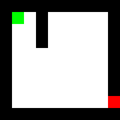

# Overview

Inspired by [Labyrinth](https://en.wikipedia.org/wiki/Labyrinth) and [OpenAI Plays Hide and Seek…and Breaks The Game!](https://www.youtube.com/watch?v=Lu56xVlZ40M), this project models and simulates a pursuit dynamic between a hunter and prey in a 2D environment using reinforcement learning (RL). The objective is to explore the emergent behaviors and dynamics that arise from such a scenario while analyzing the outcomes of the learning process over time.

A single example:

spck  test 2

phone tested

## Project Goals

The main goals of the project are to:

- **Explore Emergent Dynamics**: Study how the hunter and prey interact within the environment and observe the strategies they develop.
- **Analyze Game Outcomes**: Collect and analyze data from multiple games to evaluate trends, such as capture times, escape rates, and learning efficiency.
- **Provide a Realistic Simulation**: Simulate the pursuit-evasion scenario accurately while enabling large-scale simulation runs.
- **Enable Visualization**: Provide visual representations of individual games for deeper insights.
- **Support Efficient Experimentation**: Keep the implementation manageable by using Python and Jupyter notebooks for development and analysis.

## Modeling Pursuit Dynamics

The pursuit dynamics are framed as a Markov Decision Process (MDP), where the next state and reward depend solely on the current state and action. This allows systematic modeling of the decision-making processes for both the hunter and prey. By modeling the environment as a grid and using RL algorithms, we aim to learn optimal strategies for both actors.

## Learning Algorithms

Several reinforcement learning algorithms will be tested to model the hunter-prey interactions:

- **Q-Learning**: A model-free, value-based RL algorithm that updates Q-values based on received rewards. Q-learning is particularly suited for discrete environments like our 2D grid and is an off-policy method.
- **SARSA (State-Action-Reward-State-Action)**: An on-policy value-based algorithm that updates Q-values using the action actually taken by the policy, offering a more direct learning approach.
- **Deep Q-Networks (DQN)**: Extends Q-Learning by using deep neural networks to approximate Q-values, enabling the handling of larger state spaces or more complex environments.

## Exploration vs. Exploitation

Balancing exploration and exploitation is necessary in this project. The hunter needs to explore to learn efficient strategies to capture the prey, while the prey must explore escape routes. Striking this balance ensures that both agents improve over time while enduring penalties during the learning phase.

## Data Analysis

Data from the simulations will be analyzed to explore:

- **Convergence**: How quickly and effectively the agents learn optimal strategies.
- **Emergent Behaviors**: Unexpected strategies or interactions that develop from the learning process.
- **Learning Efficiency**: The effects of different reward structures, exploration strategies, and RL algorithms on the quality and speed of learning.

## Tools and Resources

- **Libraries and Frameworks**: TensorFlow, PyTorch, NumPy, Tkinter.
- **Hyperparameter Optimization**: Optuna will be used for finding optimal hyperparameters.
- **Data Representation**: The environment and maze are represented as `numpy` arrays for efficient computation and visualization.
